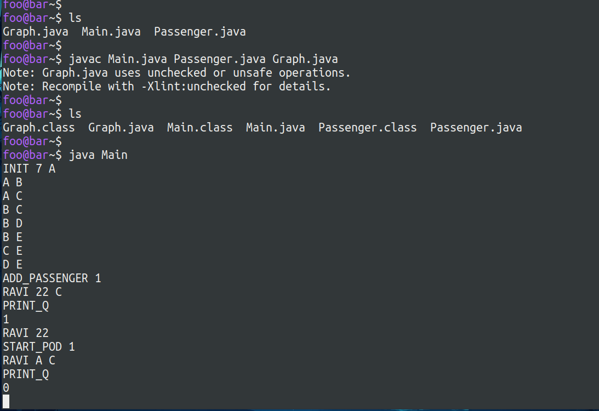

# ZOHO-Applications
```ZOHO Application development (Hyper loop passenger booking system)```
# Description:
```MAIN CLASS```
- CREATING A GRAPH 
- ADDING THE EDGES TO THE GRAPH 
- FIND ``MAXAGE`` IN THE QUEUE 
- PRINT THE SHORTEST PATH TO THE DESTINATION 
- PRINT THE NUMBER OF ELEMENTS IN THE ```QUEUE``` 
- PRINT THE OBJECT IN A LIST
- ADDING THE EDGES TO THE GRAPH WHILE GETTING FROM USER ITSELF 
- THE LOOP RUNS DEPEND UPON USER INPUTS 
- THE LOOP RUNS DEPEND UPON ```USER INPUTS``` 
- FUNCTION CALL TO PRINT ```OLDEST AGE'S SHORTEST PATH```
- PRINT THE REMAINING OBJECT IN THE QUEUE

<br/>```PASSENGER CLASS```<br/> 
- PASSENGER CLASS TO HOLD PASSENGER  DATA 
- ```CONSTRUCTOR``` TO SAVE THE OBJECTS<br/> 

```GRAPH CLASS```
- GRAPH CLASS TO ```ARRANGE THE DATA```
- CREATING A GRAPH <br/> ADDING THE EDGES TO THE GRAPH 
-  FIRST SELECT THE POSIBLE PATH AND SELECT THE SHORTEST PATH IS IN BELOW FUNCTION

# OUTPUTS:



### Compiling Source Code
```console
foo@bar-$ javac Main.java Passenger.java Graph.java
```

### Executing files
```console
foo@bar-$ java Main
```
